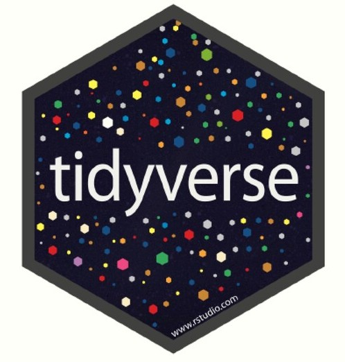

---
---
<link rel="stylesheet" href="https://cdn.rawgit.com/jpswalsh/academicons/master/css/academicons.min.css">

 
  

  

## [Exploración, manipulación y visualización de datos con tidyverse](https://juanchiem.github.io/R_Intro/)

_Curso introductorio para uso de R en Agronomía y áreas afines _ 

  

## [Ecofisiología práctica en R](https://juanchiem.github.io/ecofisio_2020/index.html)
_Resolución de actividades prácticas del curso de ecofisiología de cultivos de FCA_Balcarce _ 

