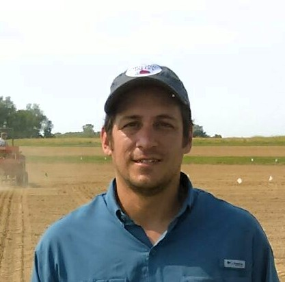
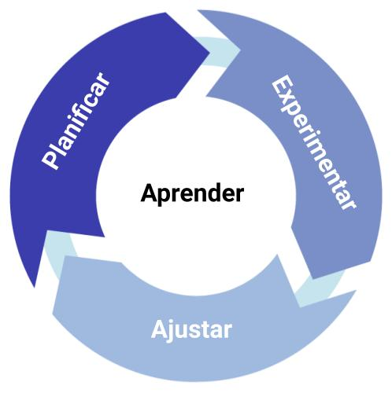

<link rel="stylesheet" href="https://cdn.rawgit.com/jpswalsh/academicons/master/css/academicons.min.css">

```{r links varios, eval=FALSE, include=FALSE}
https://jules32.github.io/rmarkdown-website-tutorial/basic_workflow.html
https://everhartlab.github.io/IntroR/index.html 
```

----



<div style="text-align: left">  
Ing. Agrónomo y M.Sc en Producción Vegetal (Univ. Nac. de Mar del Plata)
<br> 
Doctor en Fitopatología (Universidad de San Pablo - Brasil)
<br> 

La agronomía es mi gran hobbie y profesión. Mi interés general es la <br> epidemiología de enfermedades de cultivos extensivos, con particular atención en la cuantificación de su impacto sobre el rendimiento. A través de un enfoque global del sistema productivo, pretendo desarrollar estrategias de manejo de enfermedades con el menor impacto en el medio ambiente 

<br> edwardsmolina@gmail.com

</div>

----



<div style="text-align: left">  

### Notas de opinión personal sobre epidemiología y manejo de enfermedades de cultivos agrícolas

**Junio 2020** 

Fitopatometría y la necesidad de un consenso general [link](https://juanchiem.github.io/blog/dis_press.html)

</div>
